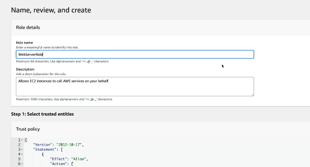
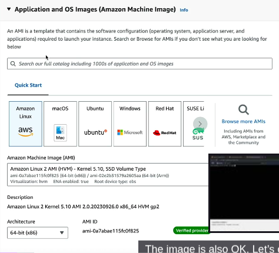
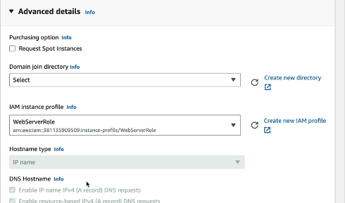
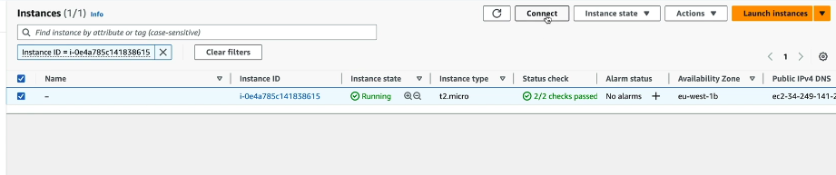
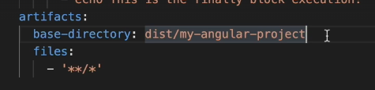
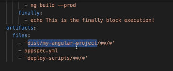
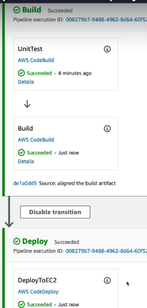
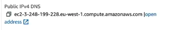

# 🚀 AWS CodeDeploy

**AWS CodeDeploy** is a fully managed deployment service that helps you automate the process of deploying applications to various compute services like:

- **Amazon EC2 instances**
- **On-premises servers**
- **AWS Lambda functions**
- **Amazon ECS containers**

---

## 🛠️ Key Features

- **Automated Deployments**: Push updates across environments (dev, test, prod) without manual intervention.
- **Supports Multiple Deployment Types**:
  - *In-place*: Updates existing instances directly.
  - *Blue/Green*: Launches new instances with the update and shifts traffic gradually or all at once.
- **Minimized Downtime**: Rolling updates and health checks ensure your app stays available.
- **Rollback Capabilities**: If something breaks, you can revert to the previous version easily.
- **Flexible Hooks**: Use lifecycle event hooks in an `appspec.yml` file to run scripts before/after deployment steps.

---

## 📦 What You Can Deploy

- Web apps  
- Serverless functions  
- Executables  
- Config files  
- Multimedia assets

---

## 🔧 Integration Possibilities

- Works with GitHub, Bitbucket, and AWS S3 for source code  
- Can be part of a CI/CD pipeline with tools like AWS CodePipeline or Jenkins

---
# 🛡️ IAM Role Creation Guide

## Step 1: Open IAM Console

- Go to the [AWS Management Console](https://aws.amazon.com/console/)
- Navigate to **IAM** (Identity and Access Management)
- In the left sidebar, click **Roles**
- Click **Create role**

---

## Step 2: Select Trusted Entity

- Under **Trusted entity type**, choose **AWS service**
- Under **Use case**, select **EC2**
- Click **Next**


---

## Step 3: Attach Permissions Policies

- Search for and select policies based on your use case:
  - `AmazonS3ReadOnlyAccess`
  - `AmazonEC2FullAccess`
  - `AmazonSSMManagedInstanceCore`
  - `AmazonEC2RoleForCodedeploy`
- You can also create a **custom policy** if needed
- Click **Next**


---

## Step 4: Add Tags (Optional)

- Tags help organize and manage roles  
  Example tags:
  - Key: `Project`, Value: `MyApp`
  - Key: `Environment`, Value: `Production`
- Click **Next**

---

## Step 5: Name and Review

- Give your role a **unique name**, e.g., `CodeDeployEC2Role`  
  In our case: `webServerRole`
- Review all settings and attached policies
- Click **Create role**



---

## Step 6: Verify Instance Profile

- AWS automatically creates an **instance profile** with the same name as the role
- This profile is what EC2 uses to assume the role

```json
{
  "Version": "2012-10-17",
  "Statement": [
    {
      "Action": [
        "s3:GetObject",
        "s3:GetObjectVersion",
        "s3:ListBucket"
      ],
      "Effect": "Allow",
      "Resource": "*"
    }
  ]
}
```

---

# 🖥️ Launching an EC2 Instance on AWS

## 🚀 Step 1: Log into AWS Console

- Visit the [AWS Management Console](https://aws.amazon.com/console/)
- Navigate to **EC2** under the “Compute” category

---

## 🏗️ Step 2: Launch Instance Wizard

- Click **Launch Instance**
- Enter a name under **Name and Tags** (e.g., `MyWebServer`)
- Click on **Create Additional Tags**


---

## 💿 Step 3: Choose an Amazon Machine Image (AMI)

- Select an AMI, such as:
  - **Amazon Linux**
  - **Ubuntu**
  - **Windows Server**
- For this guide: choose **Amazon Linux 2 AMI**



---

## 📦 Step 4: Choose an Instance Type

- Common choices:
  - `t2.micro` – eligible for free tier *(Selected)*
  - `t3a.small` or larger for heavier workloads
- Click **Next** or **Configure Instance Details**
- Proceed **without a key pair**  
  > *(Note: If terminal access is needed, create a key pair instead)*

---

## 🔐 Step 5: Configure Instance Settings

- Number of instances: `1` (default)
- Select desired **VPC** and **subnet**
- Enable **Auto-assign Public IP** *(optional for public access)*
- Set **Security Group Name**: `web-server-security-group`


---

## 🔒 Step 6: Configure Security Group

- Use existing group or create a new one
- Common inbound rules:
  - **SSH (port 22)** for Linux
  - **RDP (port 3389)** for Windows
  - **HTTP (port 80)** for web servers
- Rule 1: Default
- Rule 2: Added manually via **Add Security Rules**
- Attach the IAM role created earlier

  


---

## 📁 Step 7: Add Storage (Optional)

- Default volume size: ~8 GiB based on AMI
- Modify volume type/size as needed

---

## 🏷️ Step 8: Add Tags (Optional)

- Tags help organize resources and support billing
  - `Key: Name`, `Value: MyWebServer`
  - `Key: Environment`, `Value: Production`

---

## ✅ Step 9: Review and Launch

- Review all configurations
- Click **Launch**
- Click **Launch Instances**
- Ensure all status checks pass


---

## 🔗 Step 10: Connect to Your Instance

- Navigate to **Instances → Running Instances**
- Select your instance
- Click **Connect** for browser-based SSH terminal

  
  


---

## ⚙️ CodeDeploy Agent & Nginx Setup

```bash
# Installing CodeDeploy Agent
sudo yum update -y
sudo yum install -y ruby wget
wget https://aws-codedeploy-eu-west-1.s3.eu-west-1.amazonaws.com/latest/install
chmod +x ./install
sudo ./install auto

# Check Agent Status
sudo service codedeploy-agent status

# Install Nginx
sudo amazon-linux-extras install -y nginx1
sudo service nginx status
sudo service nginx start

# Enable Nginx on boot
sudo chkconfig nginx on

# Setup Project Directory
sudo mkdir -p /var/www/my-angular-project

# Update Nginx Configuration
sudo nano /etc/nginx/nginx.conf
# ✏️ Change root path to: /var/www/my-angular-project
# ⌨️ Exit with Ctrl + X, save with Y, confirm with Enter

# Restart Nginx
sudo service nginx restart
```

---

# 🚀 Create AWS CodeDeploy Deployment Group for Tagged EC2 Instances

---

## 📦 Step 1: Create a CodeDeploy Application

1. Open **AWS Console → CodeDeploy**
2. Click **Create Application**
3. Enter:
   - **Application Name**: `MyAngularApp`
   - **Compute Platform**: `EC2/On-Premises`
4. Click **Create Application**

---

## 🧩 Step 2: Create Deployment Group

1. In your application dashboard, click **Create Deployment Group**
2. Enter:
   - **Deployment Group Name**: `StagingGroup`
   - **Service Role**: Select IAM role (`CodeDeployServiceRole`)
   - **Deployment Type**:
     - `In-place` (selected in this example)
     - OR `Blue/Green` for zero-downtime deployments

---

## 🏷️ Step 3: Target EC2 by Tag

1. Under **Environment Configuration**, choose:
   - **Amazon EC2 instances**
2. Scroll to **Tag Group 1** and enter the tag that matches your EC2 instances:
   - **Key**: `Application`
   - **Value**: `MyAngularProject`

> ℹ️ You can add multiple Tag Groups for different environments like dev, QA, prod, etc.

3. AWS will automatically match instances with the specified tags.

---

## ⚙️ Step 4: Configure Deployment Settings

- Choose a **Deployment Configuration**:
  - `CodeDeployDefault.AllAtOnce`
  - `CodeDeployDefault.OneAtATime`
  - `CodeDeployDefault.HalfAtATime`
- (Optional) Configure:
  - Load balancer
  - Alarms and rollback settings

For this example, select:

- **Deployment Config**: `CodeDeployDefault.AllAtOnce`
- **Disable Load Balancer**

---

## 📬 Step 5: Finalize Deployment Group

1. Review all entered details
2. Click **Create Deployment Group**

🎉 Your deployment group is now ready for use in pipelines or manual deployments.

---

# 🔁 Replace S3 Bucket with EC2 in CodePipeline

## 🛠️ Step 1: Edit the Existing Pipeline

1. Navigate to your CodePipeline
2. Click **Edit Stage**
3. Remove the existing **S3 bucket** deploy action
4. Add a new **Deploy action** using your CodeDeploy EC2 deployment group

---

## 📄 Step 2: Add `appspec.yml`

### 📦 What Is `appspec.yml`?

`appspec.yml` is a deployment manifest used by AWS CodeDeploy to orchestrate how your application is installed, validated, and managed on target EC2 instances or Lambda environments.

### 🔁 Lifecycle Hook Phases (EC2/On-Premises)

| Phase              | Purpose                                      | Common Use Cases                     |
|-------------------|----------------------------------------------|--------------------------------------|
| `BeforeInstall`    | Before app files are copied                  | Stop services, backup configs        |
| `AfterInstall`     | After files are copied                       | Set permissions, config updates      |
| `ApplicationStart` | Once your app is installed                   | Start services, launch containers    |
| `ValidateService`  | Final health check for deployment success    | Ping service, run tests              |

---
### 📝 Example `appspec.yml`

```yaml
version: 0.0
os: linux

files:
  - source: dist/my-angular-project
    destination: /var/www/my-angular-project

permissions:
  - object: /var/www/my-angular-project
    pattern: '**'
    mode: '0755'
    owner: root
    group: root
    type:
      - file
      - directory

hooks:
  ApplicationStart:
    - location: deploy-scripts/application-start-hook.sh
      timeout: 300
```

## 📦 Step 3: Changes in BuildSpec File

### 🔄 Artifacts Section – Before


### ✅ Artifacts Section – After


### 🛠️ Updated buildspec.yml Configuration

```yaml
version: 0.2
phases:
  install:
    runtime-versions:
      nodejs: 20
    commands:
      - npm install -g @angular/cli@17
  pre_build:
    commands:
      - npm install
  build:
    commands:
      - ng build -c production
    finally:
      - echo 'This is the finally block execution!'
artifacts:
  files:
    - 'dist/my-angular-project/**/*'
    - appspec.yml
    - 'deploy-scripts/**/*'
```
## 🌐 Deployment Output Screenshots

### ✅ Step 1: Deployment Success


### 🔍 Step 2: Application Deployment Verified


### 🚀 Step 3: Open the Deployed Application
- 📎 Copy the link shown in the screenshot below and paste it in your browser to launch the app:



