# 🚀 AWS CodeDeploy

**AWS CodeDeploy** is a fully managed deployment service that helps you automate the process of deploying applications to various compute services like:

- **Amazon EC2 instances**
- **On-premises servers**
- **AWS Lambda functions**
- **Amazon ECS containers**

---

## 🛠️ Key Features

- **Automated Deployments**: Push updates across environments (dev, test, prod) without manual intervention.
- **Supports Multiple Deployment Types**:
  - *In-place*: Updates existing instances directly.
  - *Blue/Green*: Launches new instances with the update and shifts traffic gradually or all at once.
- **Minimized Downtime**: Rolling updates and health checks ensure your app stays available.
- **Rollback Capabilities**: If something breaks, you can revert to the previous version easily.
- **Flexible Hooks**: Use lifecycle event hooks in an `appspec.yml` file to run scripts before/after deployment steps.

---

## 📦 What You Can Deploy

- Web apps  
- Serverless functions  
- Executables  
- Config files  
- Multimedia assets

---

## 🔧 Integration Possibilities

- Works with GitHub, Bitbucket, and AWS S3 for source code  
- Can be part of a CI/CD pipeline with tools like AWS CodePipeline or Jenkins

---

# 🛡️ IAM Role Creation

## Step 1: Open IAM Console

- Go to the [AWS Management Console](https://aws.amazon.com/console/)
- Navigate to **IAM** (Identity and Access Management)
- In the left sidebar, click **Roles**
- Click **Create role**

---

## Step 2: Select Trusted Entity

- Under **Trusted entity type**, choose **AWS service**
- Under **Use case**, select **EC2**
- Click **Next**  


---

## Step 3: Attach Permissions Policies

- Search for and select policies based on your use case:
  - `AmazonS3ReadOnlyAccess`
  - `AmazonEC2FullAccess`
  - `AmazonSSMManagedInstanceCore`
  - `AmazonEC2RoleForCodedeploy` is selected
- You can also create a **custom policy** if needed
- Click **Next**  


---

## Step 4: Add Tags (Optional)

- Tags help organize and manage roles
- Example:
  - Key: `Project`, Value: `MyApp`
  - Key: `Environment`, Value: `Production`
- Click **Next**

---

## Step 5: Name and Review

- Give your role a **unique name**, e.g., `CodeDeployEC2Role`. In our Case its `webServerRole`
- Review all settings and attached policies
- Click **Create role**  


---

## Step 6: Verify Instance Profile

- AWS automatically creates an **instance profile** with the same name as the role
- This profile is what EC2 uses to assume the role

```json
{
  "Version": "2012-10-17",
  "Statement": [
    {
      "Action": [
        "s3:GetObject",
        "s3:GetObjectVersion",
        "s3:ListBucket"
      ],
      "Effect": "Allow",
      "Resource": "*"
    }
  ]
}
```

# 🖥️ Launching an EC2 Instance on AWS

## 🚀 Step 1: Log into AWS Console

- Visit the [AWS Management Console](https://aws.amazon.com/console/)
- Navigate to **EC2** under the “Compute” category

---

## 🏗️ Step 2: Launch Instance Wizard

- Click **Launch Instance**
- Enter a name under **Name and Tags** (e.g., `MyWebServer`)
- But here we will click on  **Create Additional Tags**
  
---

## 💿 Step 3: Choose an Amazon Machine Image (AMI)

- Select an AMI, such as:
  - **Amazon Linux**
  - **Ubuntu**
  - **Windows Server**
- For web servers, Amazon Linux or Ubuntu is common
- But here we will select **Amazon Linux 2 AMI**


---

## 📦 Step 4: Choose an Instance Type

- Common types:
  - `t2.micro` – eligible for free tier (We will select this)
  - `t3a.small` or larger for heavier workloads
- Click **Next** or **Configure Instance Details**
- Also, we will **Proceed without a key pair** 
- If you want to connect to EC2 instance via terminal will have to create Key Value Pair

---

## 🔐 Step 5: Configure Instance Settings

- Set the number of instances (default: 1)
- Select your desired **VPC** and **subnet**
- (Optional) Enable **Auto-assign Public IP** (if you want to access your website from internet)
- Give Security group name  **web-server-security-group**
- 
---

## 🔒 Step 6: Configure Security Group

- Select an existing security group or create a new one
- Common inbound rules:
  - **SSH (port 22)** for Linux
  - **RDP (port 3389)** for Windows
  - **HTTP (port 80)** for web servers
- Let Security Group Rule 1 be default
- Click on add new **Add Security Rules** to add Security group rule 2
- 
- In additional settings attach the IAM role which was created previously
-

---

## 📁 Step 6: Add Storage (Optional)

- Default volume size is based on AMI (~8 GiB)
- You can adjust volume type and size as needed

---

## 🏷️ Step 7: Add Tags (Optional)

- Tags help with organization and billing
- Example:
  - Key: `Name`, Value: `MyWebServer`
  - Key: `Environment`, Value: `Production`

---

## ✅ Step 9: Review and Launch

- Review all settings
- Click **Launch**
- Click **Launch Instances**
- Make sure all checks are passed
-

---

## 🔗 Step 10: Connect to Your Instance

- Go to **Instances → Running Instances**
- Select your instance
- Click **Connect** to connect to browser based SSH client/terminal
-
- Click on **Connect** again
-
- You will get browser based terminal
-
- **Code Deploy Agent and Nginx Installation**
```# Installing CodeDeploy Agent
sudo yum update -y
sudo yum install -y ruby wget
wget https://aws-codedeploy-eu-west-1.s3.eu-west-1.amazonaws.com/latest/install
chmod +x ./install
sudo ./install auto

# Checking CodeDeploy Agent status
sudo service codedeploy-agent status

# Installing Nginx
sudo amazon-linux-extras install -y nginx1

# Checking Nginx status
sudo service nginx status

# Starting Nginx
sudo service nginx start

# Enabling Nginx to restart on system reboot
sudo chkconfig nginx on

# Creating folders for deployments
sudo mkdir -p /var/www/my-angular-project

# Changing Nginx configuration
sudo nano /etc/nginx/nginx.conf

# Only change root to /var/www/my-angular-project
# Press `Ctrl + X` to exit, press `Y` to save and press `Enter` to approve.

# Restart Nginx
sudo service nginx restart
```

# 🚀 Create AWS CodeDeploy Deployment Group for Tagged EC2 Instances

## ✅ Prerequisites
- EC2 instances must be running and **tagged** (e.g., `Environment=Staging`)
- **CodeDeploy agent** must be installed and running on EC2
- Required **IAM roles**:
  - Service role for CodeDeploy (e.g., `CodeDeployServiceRole`)
  - Instance profile role attached to EC2
    #### 🧭 Step-by-Step

    1. Go to [IAM Console](https://console.aws.amazon.com/iam/)
    2. Click **Roles → Create Role**
    3. Select:
    - **Trusted Entity**: AWS Service
    - **Use Case**: CodeDeploy
    - 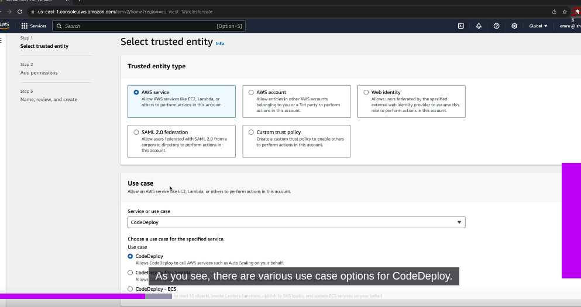
    - 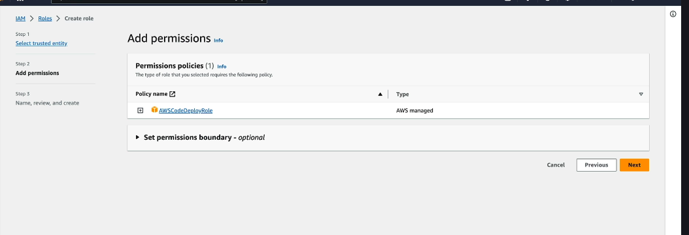 (add permission)
    4. Give Role Name **CodeDeployEC2ServiceRole** and click on create role
    - 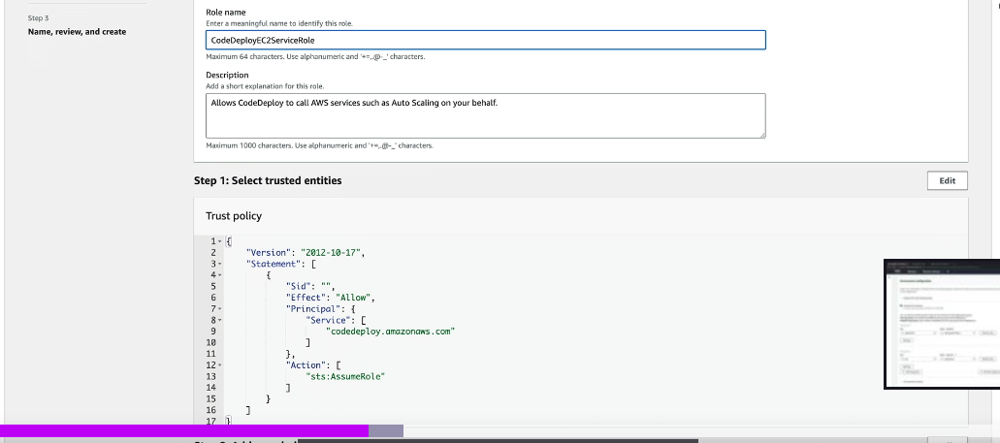
    - ## 🔐 IAM Service Role Trust Policy (CodeDeploy)

    -   ```json
        {
        "Version": "2012-10-17",
        "Statement": [
            {
            "Effect": "Allow",
            "Principal": {
                "Service": [
                "codedeploy.amazonaws.com"
                ]
            },
            "Action": [
                "sts:AssumeRole"
            ]
            }
        ]
        }
        ```
    5. Go to Add Permissions and select click add inline policy
    - 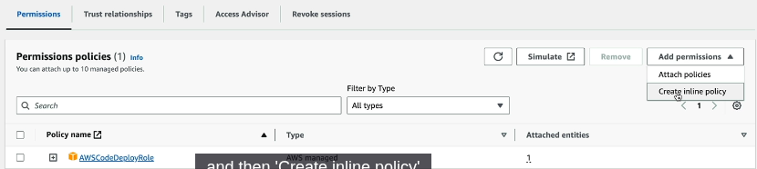
    6. In create policy screen switch to JSON
    - 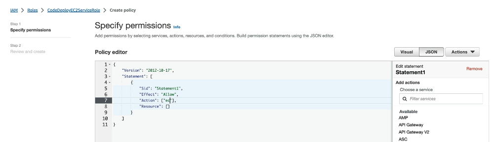
    7. ```json
        {
        "Version": "2012-10-17",
        "Statement": [
            {
            "Sid": "Statement1",
            "Effect": "Allow",
            "Action": [
                "ec2:RunInstances",
                "ec2:CreateTags",
                "iam:PassRole"
            ],
            "Resource": "*"
            }
        ]
        }
        ```
    8. # 🧠 Policy Explanation

        ## 🔧 Version

        Indicates the policy language version.  
        **"2012-10-17"** is the latest stable version used across most IAM policies.

        ---

        ## 🔧 Effect

        **"Allow"** grants permission for the actions listed under **Action**.

        ---

        ## 🔧 Sid

        Optional identifier for the statement, useful for tracking and auditing.

        ---

        ## 🔧 Action

        List of permissions being granted:

        | Action            | Purpose                                                                  |
        |-------------------|--------------------------------------------------------------------------|
        | `ec2:RunInstances`| Allows launching EC2 instances (used in Blue/Green deployments, etc.)    |
        | `ec2:CreateTags`  | Enables tagging of instances or resources for identification             |
        | `iam:PassRole`    | Lets CodeDeploy assign IAM roles to EC2 instances                        |

    10. Review and Create
        - 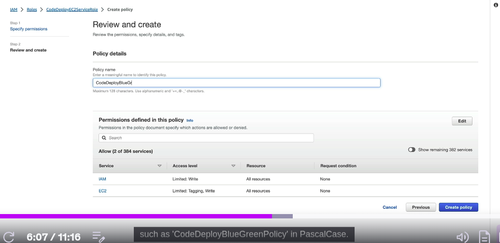
        - give name **CodeDeployBlueGreenPolicy**
    11. IAM Policy is created
        - 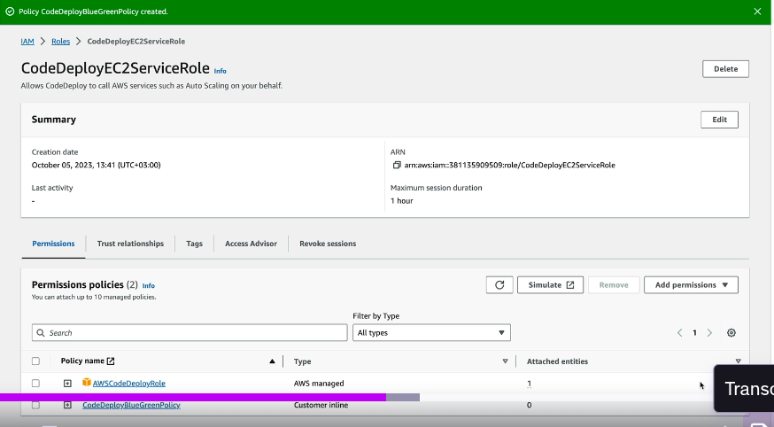

---

## 📦 Step 1: Create a CodeDeploy Application

1. Open **AWS Console → CodeDeploy**
2. Click **Create Application**
3. Enter:
   - **Application Name**: `MyAngularApp`
   - **Compute Platform**: `EC2/On-Premises`
4. Click **Create Application**
   -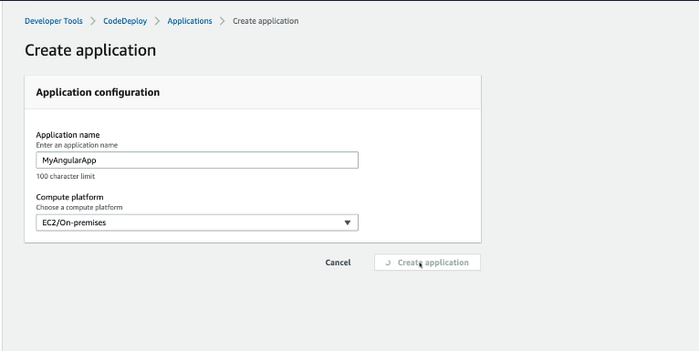
---

## 🧩 Step 2: Create Deployment Group

1. In your application dashboard, click **Create Deployment Group**
2. Enter:
   - **Deployment Group Name**: `StagingGroup`
   - **Service Role**: Select IAM role (`CodeDeployServiceRole`)
   - **Deployment Type**:
     - `In-place`
     - OR `Blue/Green` for zero-downtime deployments
     - We will select `In-place` for this example
     -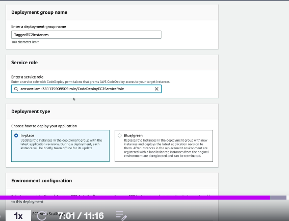

---

## 🏷️ Step 3: Target EC2 by Tag

1. Under **Environment Configuration**, choose:
   - **Amazon EC2 instances**
2. Scroll to **Tag Group 1** and enter (Same as Tags of EC2 instance):
   - **Key**: `Application`
   - **Value**: `MyAngularProject`
   - 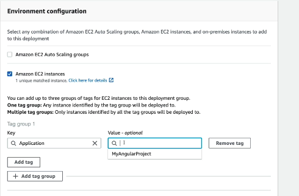
   - **Note** : we can add multiple Tag groups linking to multiple EC2 instances like dev, QA, Prod etc.
3. AWS will match instances with the tag automatically

---

## ⚙️ Step 4: Configure Deployment Settings

- Choose a **Deployment Configuration**:
  - `CodeDeployDefault.AllAtOnce`
  - `CodeDeployDefault.OneAtATime`
  - `CodeDeployDefault.HalfAtATime`
- (Optional) Configure:
  - **Load balancer**
  - **Alarms and rollback settings**
- Select `CodeDeployDefault.AllAtOnce` and disable Load balancer for this example
  - 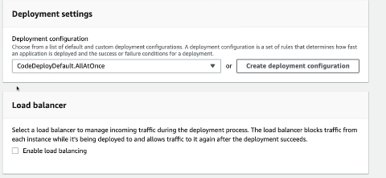
---

## 📬 Step 5: Finalize Deployment Group

1. Review all details
2. Click **Create Deployment Group**
3. Deployment group will be ready for use in pipelines or manual deployments

---

# Replacing S3 bucket with EC2 / Adding Code Deploy action to Code Pipeline

## Step 1: Edit the existing pipeline
  - 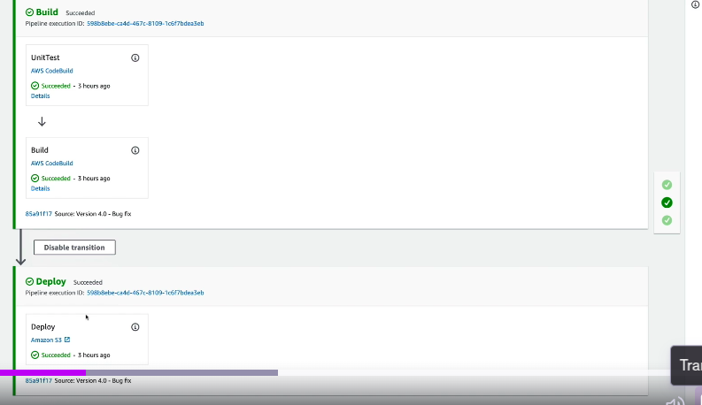
  - **Edit Stage**  button
  - 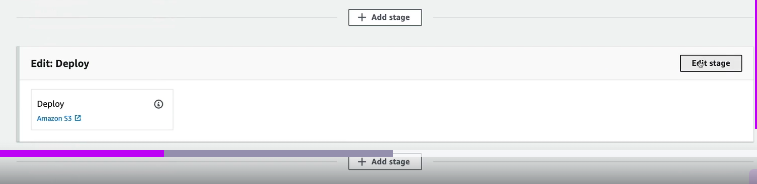
  - Remove existing s3 bucket and add new deployment group
  - 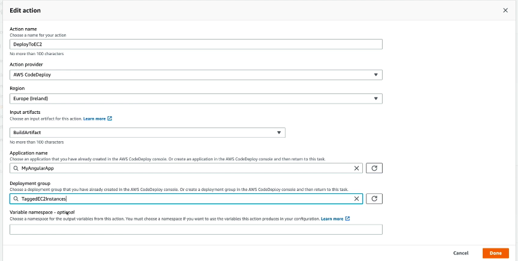

## Step 2: Appspec file
   - # 🔄 AWS CodeDeploy AppSpec Lifecycle Hooks

   - ### 📦 What Is `appspec.yml`?
        `appspec.yml` is a deployment manifest used by AWS CodeDeploy to orchestrate how your application is installed, validated, and managed on target EC2 instances or Lambda environments.
---

   - ### 🔁 Lifecycle Hook Phases (For EC2/On-Premises Deployments)

        Each phase represents a checkpoint in the deployment flow. You can attach scripts at any stage to customize behavior.

| Phase                | Purpose                                                                 | Common Use Cases                     |
|---------------------|-------------------------------------------------------------------------|--------------------------------------|
| **BeforeInstall**    | Runs before application files are copied.                              | Stop services, backup files          |
| **AfterInstall**     | Runs after files are copied.                                            | Set permissions, update configs      |
| **ApplicationStart** | Runs once your app is installed.                                        | Start services, launch containers    |
| **ValidateService**  | Final verification to ensure deployment succeeded.                      | Health checks, endpoint tests        |

---

    - # 📦 AppSpec File Explanation (AWS CodeDeploy)

```yaml
version: 0.0          # Defines the AppSpec file version.
os: linux             # Specifies that the target OS is Linux.

files:                # 📁 File Deployment Settings
  - source: dist/my-angular-project          # Source directory from your package/archive.
    destination: /var/www/my-angular-project # Target location on the EC2 instance.

permissions:          # 🔒 Post-deployment file permissions
  - object: /var/www/my-angular-project      # Path to apply permissions.
    pattern: '**'                            # Recursively apply to all files and folders.
    mode: '0755'                             # Read/write/execute for owner; read/execute for group & others.
    owner: root                              # Sets the file owner.
    group: root                              # Sets the file group.
    type:                                    # Applies changes to both files and directories.
      - file
      - directory

hooks:                # ⚙️ Lifecycle Hooks
  ApplicationStart:                         # Triggered after files are installed.
    - location: deploy-scripts/application-start-hook.sh # Runs the specified shell script.
      timeout: 300                                      # Script must complete within 5 minutes.
```
---
## Step 3: Changes in BuildSpec file
   - 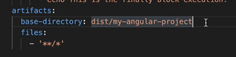
   - Change the artifacts in buildspec file
   - 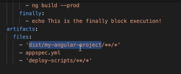
``` version: 0.2
phases:
  install:
    runtime-versions:
      nodejs: 20
    commands:
      - npm install -g @angular/cli@17
  pre_build:
    commands:
      - npm install
  build:
    commands:
      - ng build -c production
    finally:
      - echo 'This is the finally block execution!'
artifacts:
  files:
    - 'dist/my-angular-project/**/*'
    - appspec.yml
    - 'deploy-scripts/**/*'
```
---
   - 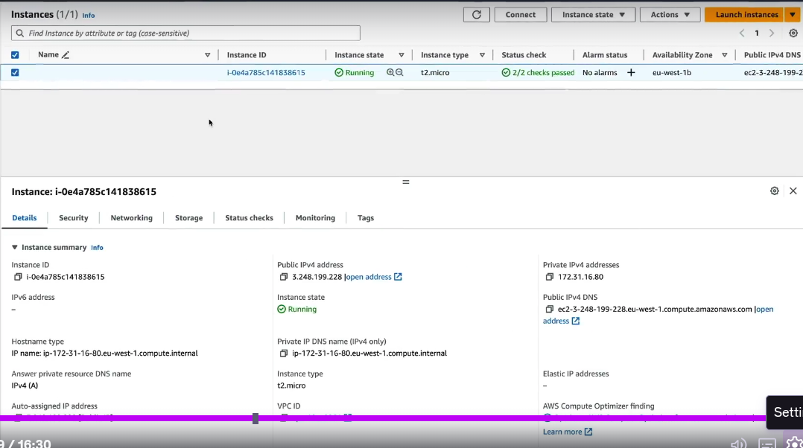
   - 
   - copy this link and paste it on browser to open ours app

   - 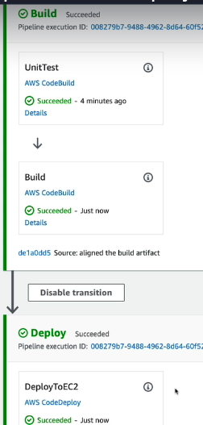 

