# 🚀 AWS CodeDeploy

**AWS CodeDeploy** is a fully managed deployment service that helps you automate the process of deploying applications to various compute services like:

- **Amazon EC2 instances**
- **On-premises servers**
- **AWS Lambda functions**
- **Amazon ECS containers**

---

## 🛠️ Key Features

- **Automated Deployments**: Push updates across environments (dev, test, prod) without manual intervention.
- **Supports Multiple Deployment Types**:
  - *In-place*: Updates existing instances directly.
  - *Blue/Green*: Launches new instances with the update and shifts traffic gradually or all at once.
- **Minimized Downtime**: Rolling updates and health checks ensure your app stays available.
- **Rollback Capabilities**: If something breaks, you can revert to the previous version easily.
- **Flexible Hooks**: Use lifecycle event hooks in an `appspec.yml` file to run scripts before/after deployment steps.

---

## 📦 What You Can Deploy

- Web apps  
- Serverless functions  
- Executables  
- Config files  
- Multimedia assets

---

## 🔧 Integration Possibilities

- Works with GitHub, Bitbucket, and AWS S3 for source code  
- Can be part of a CI/CD pipeline with tools like AWS CodePipeline or Jenkins

---

# 🛡️ IAM Role Creation

## Step 1: Open IAM Console

- Go to the [AWS Management Console](https://aws.amazon.com/console/)
- Navigate to **IAM** (Identity and Access Management)
- In the left sidebar, click **Roles**
- Click **Create role**

---

## Step 2: Select Trusted Entity

- Under **Trusted entity type**, choose **AWS service**
- Under **Use case**, select **EC2**
- Click **Next**  
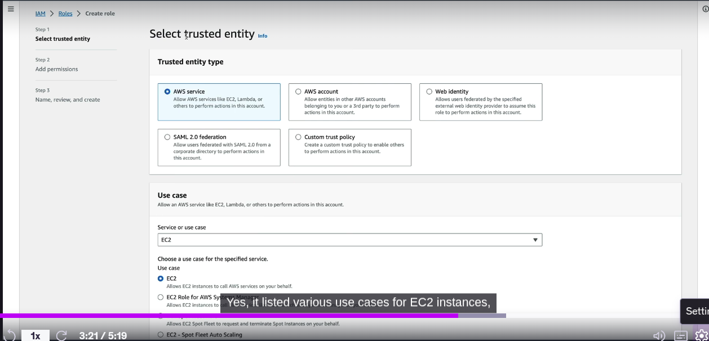

---

## Step 3: Attach Permissions Policies

- Search for and select policies based on your use case:
  - `AmazonS3ReadOnlyAccess`
  - `AmazonEC2FullAccess`
  - `AmazonSSMManagedInstanceCore`
  - `AmazonEC2RoleForCodedeploy` is selected
- You can also create a **custom policy** if needed
- Click **Next**  
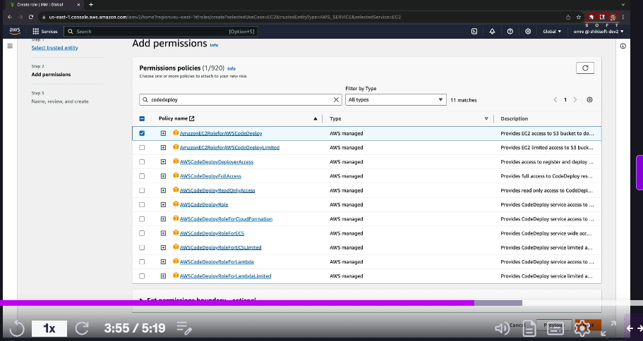

---

## Step 4: Add Tags (Optional)

- Tags help organize and manage roles
- Example:
  - Key: `Project`, Value: `MyApp`
  - Key: `Environment`, Value: `Production`
- Click **Next**

---

## Step 5: Name and Review

- Give your role a **unique name**, e.g., `CodeDeployEC2Role`. In our Case its `webServerRole`
- Review all settings and attached policies
- Click **Create role**  
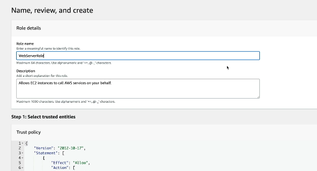

---

## Step 6: Verify Instance Profile

- AWS automatically creates an **instance profile** with the same name as the role
- This profile is what EC2 uses to assume the role

```json
{
  "Version": "2012-10-17",
  "Statement": [
    {
      "Action": [
        "s3:GetObject",
        "s3:GetObjectVersion",
        "s3:ListBucket"
      ],
      "Effect": "Allow",
      "Resource": "*"
    }
  ]
}
```

# 🖥️ Launching an EC2 Instance on AWS

## 🚀 Step 1: Log into AWS Console

- Visit the [AWS Management Console](https://aws.amazon.com/console/)
- Navigate to **EC2** under the “Compute” category

---

## 🏗️ Step 2: Launch Instance Wizard

- Click **Launch Instance**
- Enter a name under **Name and Tags** (e.g., `MyWebServer`)
- But here we will click on  **Create Additional Tags**
  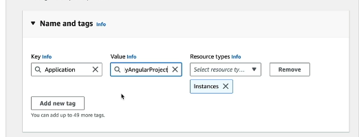
---

## 💿 Step 3: Choose an Amazon Machine Image (AMI)

- Select an AMI, such as:
  - **Amazon Linux**
  - **Ubuntu**
  - **Windows Server**
- For web servers, Amazon Linux or Ubuntu is common
- But here we will select **Amazon Linux 2 AMI**
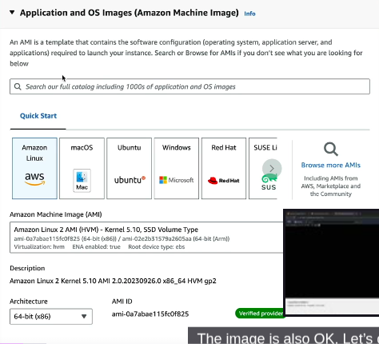

---

## 📦 Step 4: Choose an Instance Type

- Common types:
  - `t2.micro` – eligible for free tier (We will select this)
  - `t3a.small` or larger for heavier workloads
- Click **Next** or **Configure Instance Details**
- Also, we will **Proceed without a key pair** 
- If you want to connect to EC2 instance via terminal will have to create Key Value Pair

---

## 🔐 Step 5: Configure Instance Settings

- Set the number of instances (default: 1)
- Select your desired **VPC** and **subnet**
- (Optional) Enable **Auto-assign Public IP** (if you want to access your website from internet)
- Give Security group name  **web-server-security-group**
- 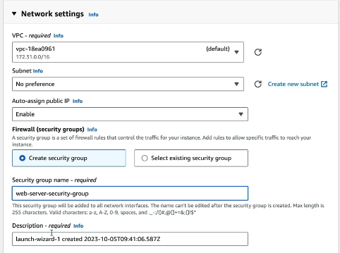
- let inbound security group be with default settings
-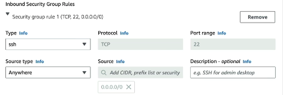
- Choose your **IAM role** if one exists (e.g., `CodeDeployEC2Role`)
-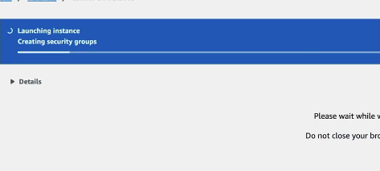

---

## 🔒 Step 6: Configure Security Group

- Select an existing security group or create a new one
- Common inbound rules:
  - **SSH (port 22)** for Linux
  - **RDP (port 3389)** for Windows
  - **HTTP (port 80)** for web servers
- Let Rule 1 be default
- Click on add new **Add Security Rules** to add Security group rule 2
- 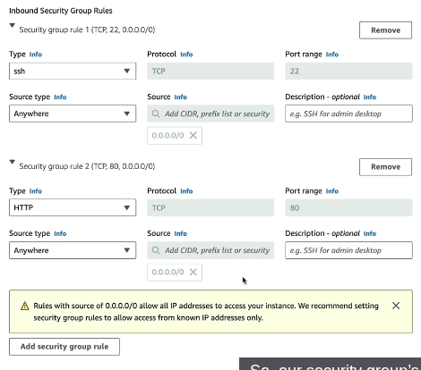
- In additional settings attach the IAM role which was created previously
-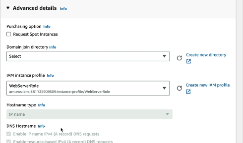

---

## 📁 Step 6: Add Storage

- Default volume size is based on AMI (~8 GiB)
- You can adjust volume type and size as needed

---

## 🏷️ Step 7: Add Tags

- Tags help with organization and billing
- Example:
  - Key: `Name`, Value: `MyWebServer`
  - Key: `Environment`, Value: `Production`

---

## ✅ Step 9: Review and Launch

- Review all settings
- Click **Launch**
- Click **Launch Instances**
- Make sure all checks are passed
-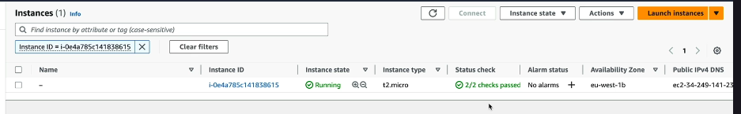

---

## 🔗 Step 10: Connect to Your Instance

- Go to **Instances → Running Instances**
- Select your instance
- Click **Connect** to connect to browser based SSH cliet/terminal
-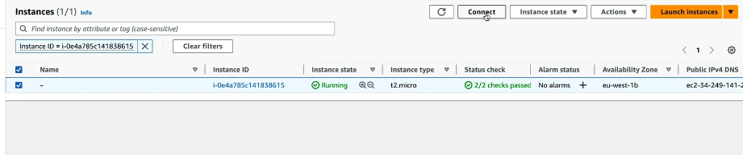
- Click on **Connect** again
-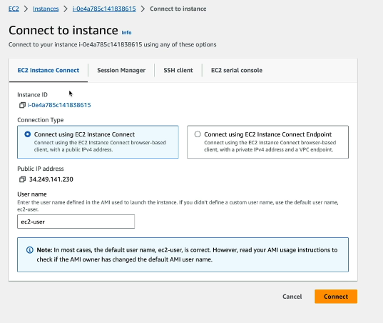
- You will get browser based terminal
-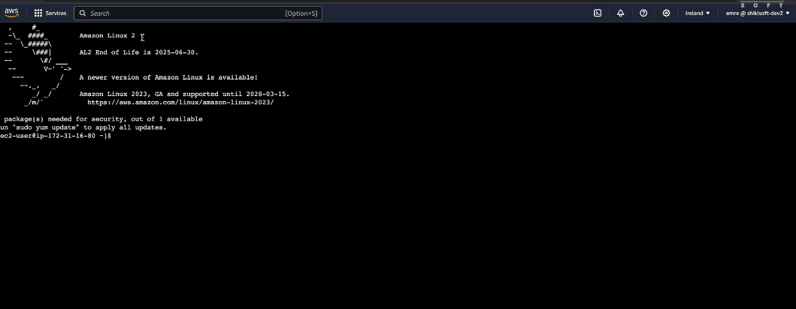
-- **Code Deploy Installtion**
```
# 🚀 AWS CodeDeploy Agent Installation Steps for Amazon Linux 2 (AMI 2)

# 🖥️ Step 1: Update system and install required packages
sudo yum update -y                          # Update all system packages
sudo yum install -y ruby wget               # Install Ruby and wget (required for agent installer)

# 🌐 Step 2: Download and install CodeDeploy agent
cd /home/ec2-user                           # Navigate to home directory
wget https://aws-codedeploy-ap-south-1.s3.ap-south-1.amazonaws.com/latest/install  # Download installer (replace region if needed)
chmod +x ./install                          # Make installer executable
sudo ./install auto                         # Run installer in automatic mode

# ✅ Step 3: Verify agent status using both methods
echo "🔍 Checking CodeDeploy Agent status via systemctl:"
sudo systemctl status codedeploy-agent      # Preferred method (systemd)

echo "🔍 Checking CodeDeploy Agent status via service:"
sudo service codedeploy-agent status        # Legacy-compatible method

# 🔄 Optional: Start or restart agent manually
sudo systemctl start codedeploy-agent       # Start agent if not running
sudo systemctl restart codedeploy-agent     # Restart agent if needed

# 🛠️ Troubleshooting: View agent logs
cat /var/log/codedeploy-agent/codedeploy-agent.log  # Check logs for errors or status messages

# 🔄 Optional: Update CodeDeploy agent
sudo yum upgrade -y codedeploy-agent        # Upgrade to latest version if available
```
- **Installing Nginx Server**
```
# 🌐 NGINX Installation Steps for Amazon Linux 2 (AMI 2)
# Includes both modern (systemctl) and legacy-compatible (service) commands

# 🖥️ Step 1: Update system packages
sudo yum update -y                          # Refresh system packages to latest

# 📦 Step 2: Install NGINX using amazon-linux-extras (two approaches)

# ✅ Recommended Method: Enable repo and install via yum
sudo amazon-linux-extras enable nginx1      # Activate nginx repository
sudo yum install -y nginx                   # Install the nginx package

# 🧩 Optional Method: Direct install via amazon-linux-extras (more compact)
# This combines enabling and installing in one step
# Uncomment the line below if you prefer this style:
# sudo amazon-linux-extras install -y nginx1

# 🌐 Step 3: Start and enable NGINX service (modern method)
sudo systemctl start nginx                  # Start nginx using systemd
sudo systemctl enable nginx                 # Enable nginx to launch on boot

# 🔄 Step 4: Start and enable NGINX using legacy-compatible service commands
sudo service nginx start                    # Start nginx service using SysVinit wrapper
sudo chkconfig nginx on                     # Enable nginx to start on boot (legacy equivalent)

# 🔍 Step 5: Check NGINX service status using both methods

echo "🔍 NGINX status via systemctl:"
sudo systemctl status nginx                 # Preferred detailed service info (systemd)

echo "🔍 NGINX status via service (legacy):"
sudo service nginx status                   # Lightweight compatibility check

# 📌 Notes:
# - Ensure your EC2 security group allows inbound traffic on port 80 (HTTP)
# - Web root directory: /usr/share/nginx/html
# - Config file path: /etc/nginx/nginx.conf
```
---
