 # 🛠️ What Is AWS CodeBuild?

**AWS CodeBuild** is a fully managed continuous integration (CI) service by Amazon Web Services. It:
- Compiles source code
- Runs automated tests
- Generates deployable artifacts

✨ CodeBuild scales automatically based on build volume and eliminates the need to manage or provision your own build servers.

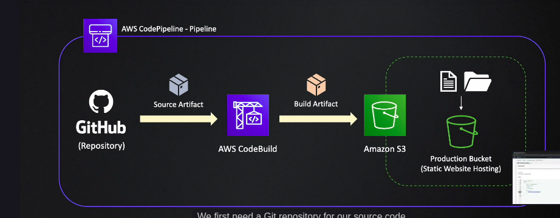

---

## 🪣 Step 1: Create an S3 Bucket for Hosting

### 1️⃣ Create a New Bucket
- Navigate to **Amazon S3** > click **Create bucket**
- Enter a **unique bucket name**  
  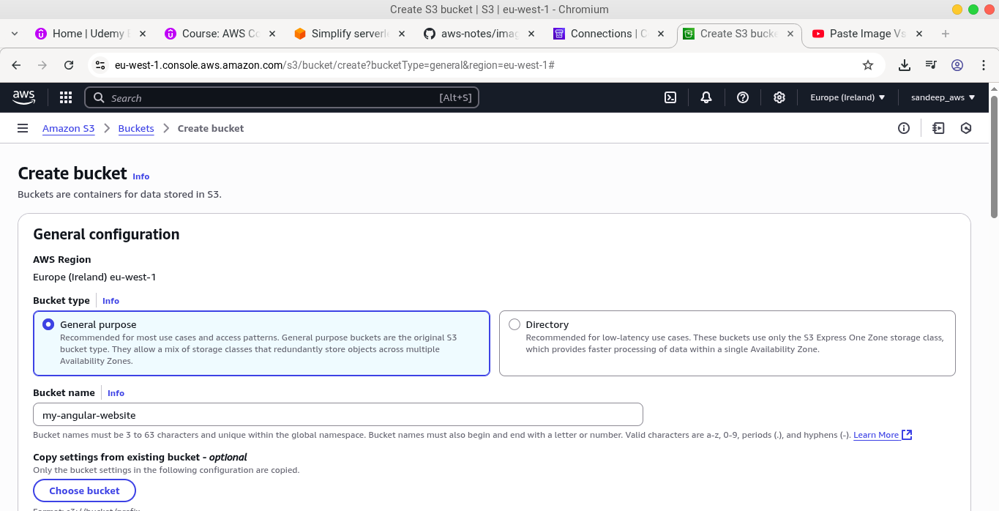

### 2️⃣ Configure Public Access
- **Uncheck** _Block all public access_ to allow internet users to access the bucket contents  
  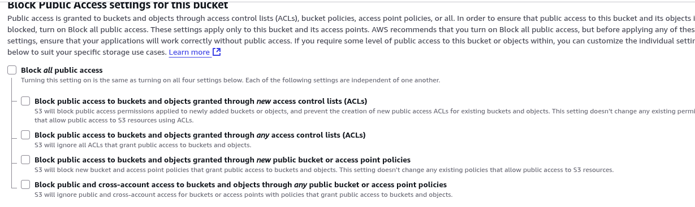

### 3️⃣ Finalize Bucket Creation
- Click **Create Bucket**

---

### 4️⃣ : Set Bucket Permissions

- Open the **S3 Buckets page**, select your new bucket
- Go to the **Permissions** tab  
  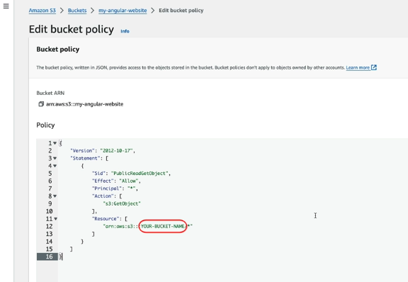

- **📜 Add Bucket Policy:**
Replace `YOUR-BUCKET-NAME` with your actual bucket name.

```json
{
  "Version": "2012-10-17",
  "Statement": [
    {
      "Sid": "PublicReadGetObject",
      "Effect": "Allow",
      "Principal": "*",
      "Action": ["s3:GetObject"],
      "Resource": ["arn:aws:s3:::YOUR-BUCKET-NAME/*"]
    }
  ]
}
```
**🔐 Understanding the S3 Bucket Policy**

```{
  "Principal": "*",        // 🌍 Allows access to everyone (public access)
  "Action": "s3:GetObject",// 📥 Grants permission to view/download objects
  "Resource": "arn:aws:s3:::YOUR-BUCKET-NAME/*" // 🎯 Targets all files (*) inside the specified bucket
}
```
### 5️⃣ Enable Static Website Hosting for Angular App

To configure Amazon S3 for hosting an Angular Single Page Application (SPA):

- 🛠️ Navigate to the **Properties** tab of your S3 bucket
- 🖱️ Click **Edit** under **Static website hosting**
- 🧾 Set both documents to:
  - **Index document** → `index.html`
  - **Error document** → `index.html` _(important for client-side routing)_
- 💾 Click **Save**  
  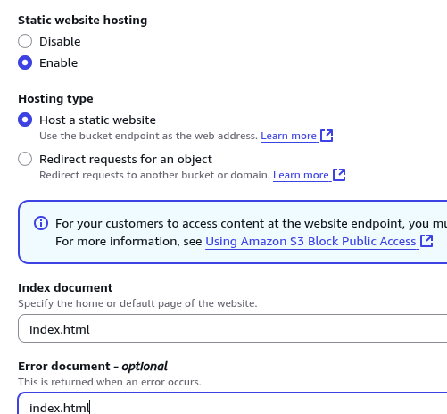

✅ Your Angular app is now ready to be served via Amazon S3's static hosting!

✅ Once this is done, your bucket is configured to serve your Angular application using S3's static hosting.

## Step 2 Creating CodePipeline with CodeBuild (Angular App Deployment)

Set up a CI/CD pipeline on AWS to automate building and deploying your Angular app:

---

### 🔨 1. Create Pipeline

- Start creating a new pipeline from the AWS CodePipeline console.

---

### ⚙️ 2. Choose Custom Build

- Select the **Custom build** option  
  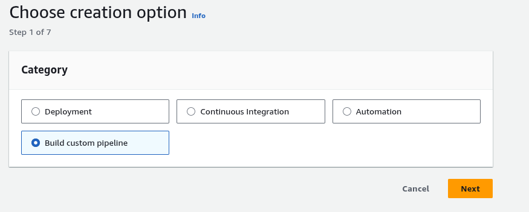

---

### 📋 3. Configure Pipeline Settings

- Enter a **Pipeline name**
- Keep other default settings  
  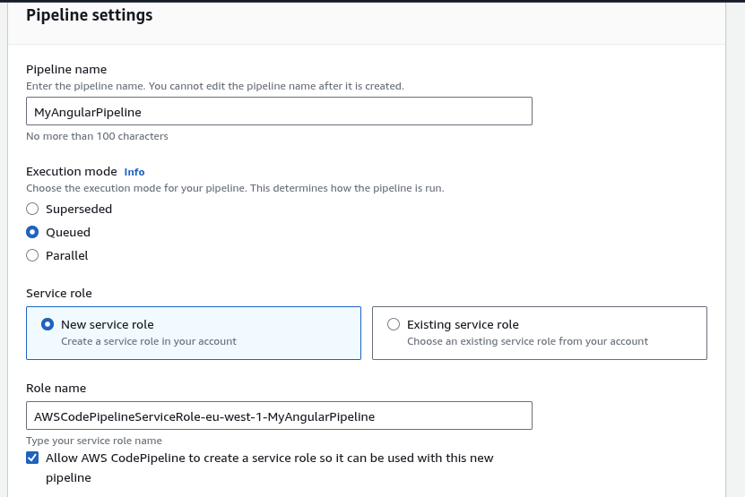

---

### 🌐 4. Set Up Source

- Choose **GitHub App**
- Select the GitHub connection, repository, and target branch  
  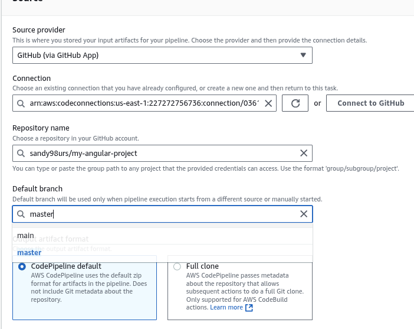

---

### 🧱 5. Add Build Stage

- Select **Other build provider**
- Choose **AWS CodeBuild**
- Click **Create Project**  
  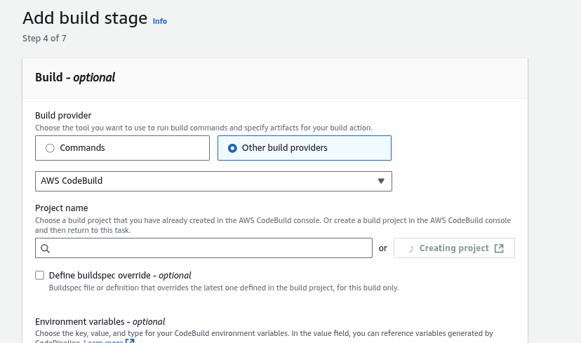

---

### 🏗️ 6. Configure CodeBuild Project

- Provide a **name** for the build project
- Open **Additional settings**
  - ✅ Enable: *"Restrict number of concurrent builds this project can start"*
  - 🧮 Set **build limit** to `1` (reduces cost)  
  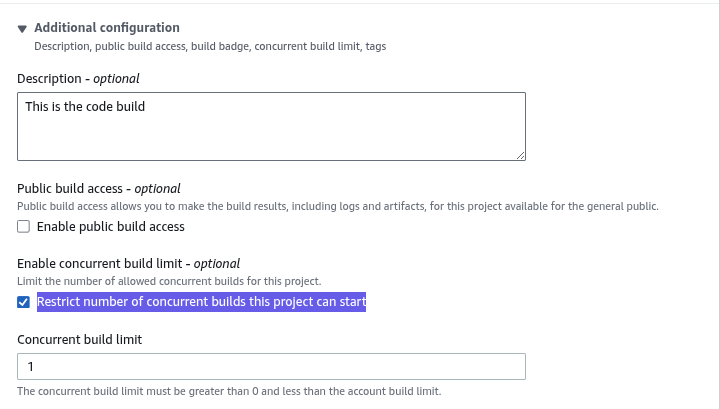

---

### 🧰 7. Choose Environment

- Select an appropriate **Operating System** and **Runtime image** (e.g., Node.js version)  
  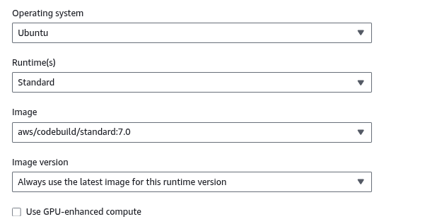

---

### 📝 8. Specify BuildSpec File

- Choose the BuildSpec file (e.g., `buildspec.yml`) from your source  
  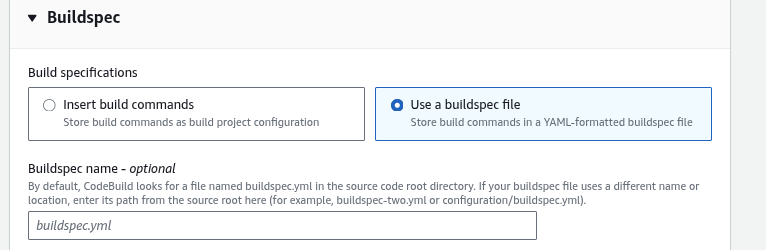

---

### 🔄 9. Use Default Pipeline Settings

- Accept default values and click **Continue to CodePipeline**  
  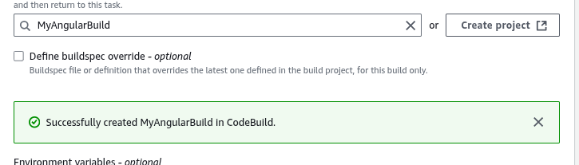

---

### 🔗 10. Review Runtime Environments

- Reference official AWS supported environments:  
  [AWS CodeBuild Runtimes](https://docs.aws.amazon.com/codebuild/latest/userguide/available-runtimes.html)

---

### 🚀 11. Deployment Stage

- Select **S3 Bucket** as deployment provider  
  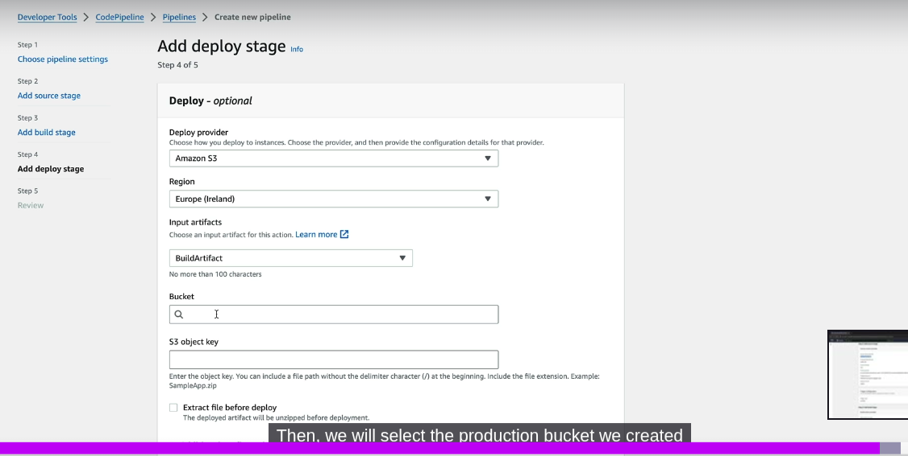

---

### 📦 12. Enable Artifact Extraction

- ✅ Check: *Extract file before deployment*  
  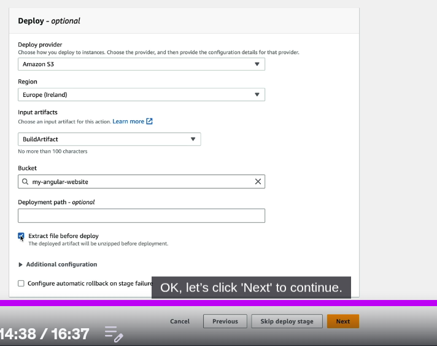

### ⚙️ 13. Build Spec file
```
version: 0.2  # 🧾 BuildSpec schema version — must be 0.2

phases:
  install:  # 🧰 Phase 1: Install essential tools and define environment
    runtime-versions:
      nodejs: 20  # ⚙️ Use Node.js version 20
    commands:
      - npm install -g @angular/cli@17  # 🚀 Install Angular CLI globally (v17)

  pre_build:  # 🔧 Phase 2: Install dependencies
    commands:
      - npm install  # 📦 Install all packages from package.json

  build:  # 🏗️ Phase 3: Build the Angular app
    commands:
      - ng build -c production  # 🔨 Build app in production mode

artifacts:
  base-directory: dist/my-angular-project  # 📁 Output folder after build
  files:
    - '**/*'  # 📦 Include all files recursively for deployment
```
- ✅ Just save this as buildspec.yml in the root directory of your project, and you're all set for CodeBuild to pick it up!
---


