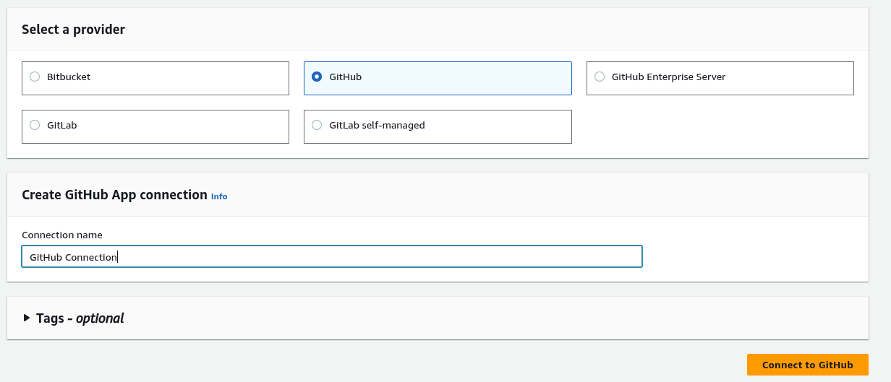

1. Git hub connection to AWS
Goto pipeline > settings > connections > create connection

2.Give name > create connection

3. Authorise

4. Click on install new connector APP

5. Select ALL repo 

6. Click on connect

