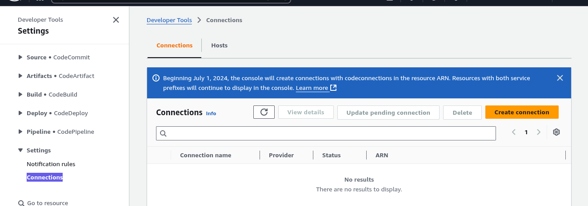

# 🔗 Creating a GitHub Connection in AWS CodePipeline

This guide walks you through the process of connecting your GitHub account to AWS CodePipeline so you can trigger builds and deployments from your repositories.

---

## 🪄 Step 1: Navigate to Connection Settings

- Go to **AWS CodePipeline**
- Open **Pipeline settings** > **Connections**
- Click **Create Connection**  
  

---

## ✏️ Step 2: Name Your Connection

- Enter a connection name of your choice
- Click **Create Connection**  
  

---

## 🔐 Step 3: Authorize GitHub

- Click on **Authorize** to link your GitHub account  
  

---

## 🧩 Step 4: Install GitHub Connector App

- Select **Install new connector app**  
  

---

## 📂 Step 5: Select Repository Access

- Choose **ALL repositories** to allow AWS access to all your GitHub projects  
  

---

## 🛠️ Step 6: Finalize Connection

- Click **Connect** to complete the GitHub integration  
  

---
